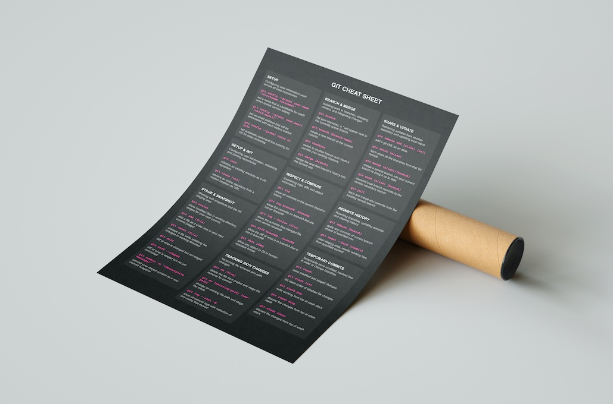

# cheatsheets.tech

Source code of https://cheatsheets.tech



Cheat sheets sources are in the `src/cheatsheets` folder. Their standard syntax looks like this:

```javascript
{
  kind: "root",
  title: "Root Title",
  // optional, number of columns will be calculated automatically if missing
  columns: { horizontal: 4, vertical: 3 },
  // optional, keep the order or try rearranging sections to align them better  
  needArrangement: false,
  items: [
    {
      kind: "section",
      title: "Section Title",
      description: "Section Description",
      items: [
        {
          kind: "cheat",
          command: "Command or Code",
          description: "Cheat Description",
        },
        ...
     },
     ...
  ]
}
```
